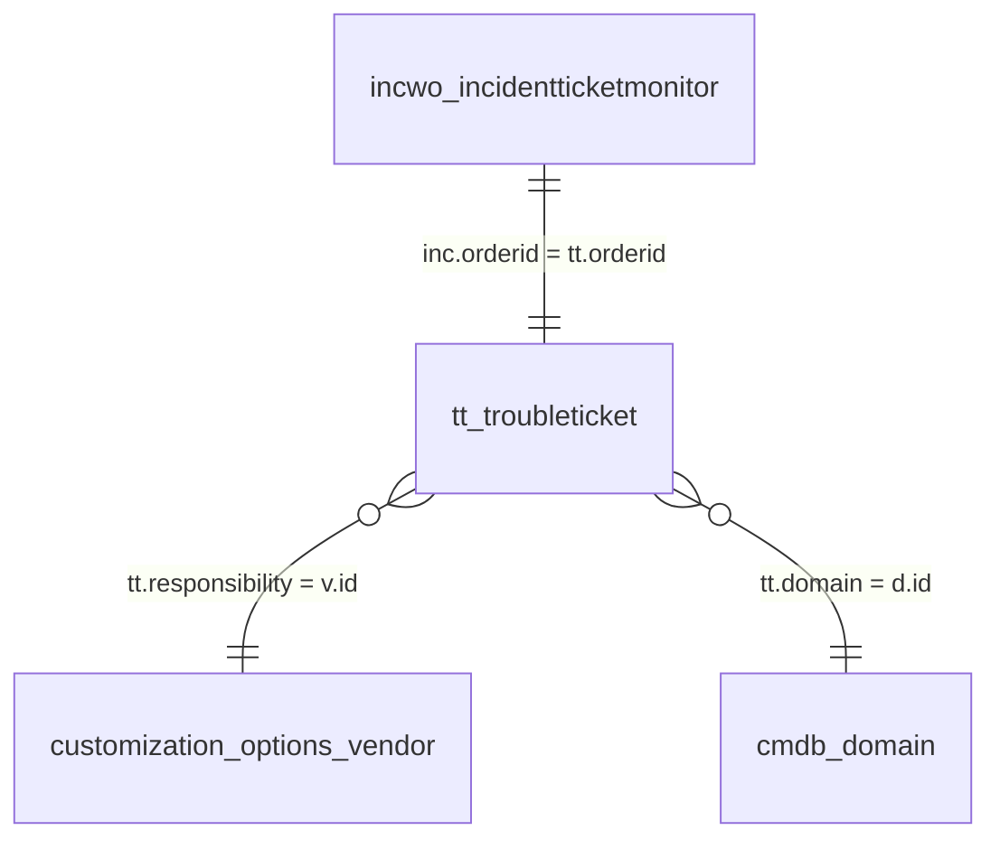

# LOGIC FOR INCIDENT TICKET MONITOR
## OWS Surge NOC Dashboard: Incident Ticket Monitor (FWA & FTTH)

Dokumen ini merangkum seluruh logika bisnis, arsitektur data, alur servis (TQL / SQL), relasi antar entitas, mekanisme sinkronisasi dua arah (Two-Way Sync), serta detail implementasi frontend dan backend untuk modul **Incident Ticket Monitor** pada Huawei OWS ADC Studio.

---

## 1. Arsitektur Solusi & Konsep Entitas

Modul **Incident Ticket Monitor** berfungsi sebagai sistem *Critical Ticket Watchlist* untuk memantau tiket insiden berprioritas tinggi dari domain **FWA** (termasuk FWA-RAN, RAN) dan **FTTH**.

### 1.1. Dual-Entity Architecture (Lokal Watchlist vs Live Master Ticket)

Untuk menjaga performa dan integritas data tiket utama OWS, arsitektur dibagi menjadi 2 layer entitas:

```
+-------------------------------------------------------------------------------+
|                        OWS Trouble Ticket Core System                         |
|             Entity: /TroubleTicket/TroubleTicket/tt_troubleticket             |
|                  (Single Source of Truth - Live Data)                         |
+-------------------------------------------------------------------------------+
       ^                                                 |
       | Update incident_chronology                      | Live Query (LEFT JOIN TQL)
       | (hanya saat user simpan)                        | Read-Only Realtime
       |                                                 v
+-------------------------------------------------------------------------------+
|                   Dashboard Local Watchlist Entity (ADC)                      |
| Entity: /CN_GSC_ID_Surge_Noc_Dashboard/IncidentTicketMonitor/incwo_incidentticketmonitor |
|               (Menyimpan State Watchlist, Filter, & Custom Meta)              |
+-------------------------------------------------------------------------------+
                               |
                               | REST Service Invoker
                               v
+-------------------------------------------------------------------------------+
|                    Frontend UI (Incident Ticket Monitor)                      |
|                  Pure Vanilla JS + Vanilla CSS (No Framework)                 |
+-------------------------------------------------------------------------------+
```

1. **Entitas Utama OWS (`/TroubleTicket/TroubleTicket/tt_troubleticket`)**:
   - Sumber kebenaran tunggal (*Single Source of Truth*) untuk data live tiket: status, alarm time, clear time, root cause, sub root cause, impact site list, responsibility, dan timeline kronologi (`incident_chronology`).
   - Sistem incident monitor **TIDAK PERNAH** menimpa (*overwrite*) field vital tiket utama (seperti root cause, status, atau waktu) secara sepihak, kecuali catatan kronologi (`incident_chronology`).

2. **Entitas Lokal Dashboard (`incwo_incidentticketmonitor`)**:
   - Bertindak sebagai penyimpan daftar tiket yang sedang dipantau (*active watchlist*), urutan penambahan (`create_time`), kategori domain dashboard (`tt_domain`), serta metadata Change Management (`cm_orderid`).
   - Tiket dihapus dari tampilan menggunakan mekanisme *soft delete* (`active = false`).

---

## 2. Perbandingan Perilaku Domain: FWA vs FTTH

| Parameter / Fitur | Domain FWA (FWA-RAN / RAN) | Domain FTTH |
| :---| :---| :---|
| **Kriteria Deteksi Domain** | Domain tiket **tidak mengandung** kata `FTTH` (misal `FWA`, `FWA-RAN`, `RAN`) | Domain tiket **mengandung** substring `FTTH` (`d.name like '%FTTH%'`) |
| **Badge Warna UI** | Biru Laut (`#38bdf8` / `.custom-domain-badge.fwa`) | Ungu Lavender (`#c084fc` / `.custom-domain-badge.ftth`) |
| **Field Estimated CP (Fiber Doctor/OTDR)** | Ditampilkan tanda `-` (karena bukan gangguan kabel serat optik FTTH) | Menampilkan estimasi titik putus kabel/closure dari `tt.estimated_cp` jika ada |
| **Pencarian Tiket Running** | `d.name like '%FWA%'` | `d.name like '%FTTH%'` |
| **Karakteristik Dampak** | Berdampak pada cell/site radio FWA (`impactsitelist`) | Berdampak pada link/kabel distribusi OLT & pelanggan FTTH |

---

## 3. Logika Backend Service & Query TQL

### 3.1. Query Ticket List (Tampilan Utama Dashboard)
- **Script File:** `services/incwo_query_tt_info_get_list.js`
- **Tujuan:** Mengambil seluruh tiket aktif di watchlist, digabung langsung secara *live* dengan tabel `tt_troubleticket` dan tabel vendor.
- **Relasi TQL:**
  - `incwo_incidentticketmonitor` (`inc`) sebagai tabel dasar watchlist.
  - `LEFT JOIN /TroubleTicket/TroubleTicket/tt_troubleticket` (`tt`) dengan kunci `inc.orderid = tt.orderid`.
  - `LEFT JOIN /DataSource/msup_customization_options/customization_options_vendor` (`v`) dengan kunci `tt.responsibility = v.id` untuk meresolusi UUID PIC kontraktor menjadi nama vendor yang mudah dibaca.

```sql
SELECT DISTINCT 
    inc.orderid, 
    inc.tt_domain, 
    inc.title, 
    inc.cm_orderid, 
    inc.inter_station, 
    inc.pic,
    inc.alarm_time, 
    inc.root_cause, 
    inc.sub_root_cause, 
    inc.rca_description, 
    inc.predictive_etr,
    inc.estimated_cp, 
    inc.tt_action,
    tt.ticketstatus,
    tt.title AS tt_live_title,
    tt.createfaultfirstoccurtime AS tt_live_alarm_time,
    tt.closetime AS tt_live_clear_time,
    tt.root_cause AS tt_live_root_cause,
    tt.sub_root_cause AS tt_live_sub_root_cause,
    tt.impactsitelist AS tt_live_impactsitelist,
    tt.incident_chronology AS tt_live_action,
    tt.estimated_cp AS tt_live_estimated_cp,
    v.name AS vendor_name,
    v.label AS vendor_label,
    tt.responsibility AS tt_live_responsibility
FROM "/CN_GSC_ID_Surge_Noc_Dashboard/IncidentTicketMonitor/incwo_incidentticketmonitor" AS inc
LEFT JOIN "/TroubleTicket/TroubleTicket/tt_troubleticket" AS tt ON inc.orderid = tt.orderid
LEFT JOIN "/DataSource/msup_customization_options/customization_options_vendor" AS v ON tt.responsibility = v.id
WHERE inc.active = true 
ORDER BY inc.tt_domain, inc.create_time DESC;
```

#### Aturan Pemrosesan Data di JavaScript:
1. **Prioritas Live Data (Strict)**: Field `title`, `alarm_time`, `clear_time`, `root_cause`, `sub_root_cause`, `impactsitelist`, dan `tt_action` diambil langsung dari prefix `tt_live_*`. Tidak melakukan fallback ke snapshot lokal.
2. **Resolusi Nama PIC Contractor**:
   ```javascript
   let livePic = !COMMON_UTIL.isNull(info.vendor_name)
       ? info.vendor_name
       : (!COMMON_UTIL.isNull(info.vendor_label)
           ? info.vendor_label
           : (!COMMON_UTIL.isNull(info.tt_live_responsibility) ? info.tt_live_responsibility : ""));
   ```
3. **Konversi Zona Waktu**:
   `alarm_time` dan `clear_time` dikonversi dari UTC ke zona waktu runtime ADC via `TimeUtil.utc2Local(time, zoneId)`.
4. **Kalkulasi Aging Time Realtime**:
   ```javascript
   function getAgingTime(alarmTime, timeUTC7) {
       if (COMMON_UTIL.isNull(alarmTime)) return "";
       let alarmTimestamp = TimeUtil.parseTimestamp(alarmTime, "yyyy-MM-dd HH:mm:ss");
       const diffMs = Math.abs(Number(timeUTC7) - Number(alarmTimestamp));
       const totalMinutes = Math.floor(diffMs / (1000 * 60));
       const hours = Math.floor(totalMinutes / 60);
       const minutes = totalMinutes % 60;
       return hours + " hours " + minutes + " minutes";
   }
   ```
5. **Alarm Status Flag**:
   - Jika `clear_time` masih kosong -> `"OPEN"`
   - Jika `clear_time` sudah terisi -> `"Related To The Clear Time"`

---

### 3.2. Query Running Tickets Dropdown (Add Work Order)
- **Script File:** `services/incwo_query_link_down_tt_list.js`
- **Tujuan:** Menyediakan daftar rekomendasi autocomplete tiket saat user mengetikkan nomor tiket di modal tambah.
- **Kondisi Filter:**
  - Status tiket wajib `ticketstatus = 'running'`.
  - Filter domain menggunakan operator `LIKE %FWA%` dan `LIKE %FTTH%` (tidak dibatasi kaku agar variasi seperti `FWA-RAN` atau `FWA Core` tetap terjaring).
  - Jika user menginput query order ID, query menambahkan klausul `tt.orderid like '%${orderid}%'`.

```sql
SELECT 
    orderid, 
    tickettype, 
    ticketstatus AS ticket_status, 
    title,
    createtime, 
    createfaultfirstoccurtime AS alarm_time,
    faultresolvingtime AS clear_time, 
    root_cause, 
    sub_root_cause, 
    d.name AS domain
FROM "/TroubleTicket/TroubleTicket/tt_troubleticket" AS tt
LEFT JOIN "/datahub/cmdb/cmdb_domain" AS d ON d.id = tt.domain 
WHERE ticketstatus = 'running' 
  -- [Dynamic filter domain: and (d.name like '%FWA%') atau and (d.name like '%FTTH%')]
  -- [Dynamic search: and tt.orderid like '%INC-XXXX%']
ORDER BY orderid DESC
LIMIT 1000;
```

---

### 3.3. Create Work Order (Menambahkan ke Watchlist)
- **Script File:** `services/incwo_create_tt_info.js`
- **Validasi & Business Rules:**
  1. **Batas Maksimal Watchlist:** Maksimal **8 tiket** aktif (jika `total >= 8`, kembalikan error `The number of work orders has already reached 8`).
  2. **Pencegahan Duplikasi:** Tiket yang sudah ada di daftar aktif tidak boleh ditambahkan ulang.
  3. **Verifikasi Tiket Utama:** Tiket wajib berstatus `running` di entitas `tt_troubleticket`.
  4. **Ekstraksi CM Order ID:**
     Jika pada `tt.associateorderid` terdapat relasi tiket CM (contoh: `CM-20260901-00000099;INC-...`), parsing dan simpan nomor CM secara otomatis.
  5. **Batch Upsert:** Menyimpan metadata awal ke `/CN_GSC_ID_Surge_Noc_Dashboard/IncidentTicketMonitor/incwo_incidentticketmonitor_batch_upsert`.

```sql
-- Query Verifikasi Tiket Sebelum Ditambahkan
SELECT 
    orderid,
    tickettype,
    ticketstatus AS ticket_status,
    title, 
    associateorderid,
    createtime,
    createfaultfirstoccurtime AS alarm_time,
    faultresolvingtime AS clear_time,
    root_cause,
    sub_root_cause,
    link_segment,
    initial_rca,
    estimated_cp,
    incident_chronology AS tt_action,
    tt.domain AS raw_domain, 
    d.name AS domain
FROM "/TroubleTicket/TroubleTicket/tt_troubleticket" AS tt
LEFT JOIN "/datahub/cmdb/cmdb_domain" d ON d.id = tt.domain 
WHERE orderid = $orderid AND ticketstatus = 'running'
ORDER BY orderid DESC;
```

---

### 3.4. Query Detail Work Order (Popup View & Edit)
- **Script File:** `services/incwo_query_tt_detail.js`
- **Tujuan:** Mengambil detail lengkap tiket saat modal edit dibuka.
- **Logika Fetch:**
  1. Mengambil data dari tabel lokal `incwo_incidentticketmonitor_get`.
  2. Melakukan live query ke `tt_troubleticket_get`.
  3. Mengambil `liveResult.responsibility` lalu memanggil fungsi `getVendorName(vendorId)` dengan query TQL ke `/DataSource/msup_customization_options/customization_options_vendor`.
  4. Mengambil live `root_cause`, `sub_root_cause`, `impactsitelist`, `title`, dan `incident_chronology`.

```sql
-- Resolusi Nama Vendor / Kontraktor
SELECT name, label 
FROM "/DataSource/msup_customization_options/customization_options_vendor" 
WHERE id = $id 
LIMIT 1;
```

---

### 3.5. Update Work Order (Two-Way Sync Safeguard)
- **Script File:** `services/incwo_update_tt_info.js`
- **Alur Penyimpanan:**
  1. **Update ke Tabel Lokal Dashboard**:
     Menyimpan perubahan `root_cause`, `sub_root_cause`, `rca_description`, `tt_action`, dan `pic` ke `incwo_incidentticketmonitor_update`.
  2. **Sinkronisasi Aman ke Tiket Utama OWS**:
     - Sistem membaca data live `tt_troubleticket_get`.
     - **HANYA field `incident_chronology`** yang diperbarui ke tiket utama (`tt_troubleticket_update`) jika user mengubah isi Action Log.
     - Field sensitif lainnya di tabel utama diisolasi agar tidak mengubah state tiket secara ilegal.

```javascript
// Cuplikan sinkronisasi kronologi ke tiket utama
if (!COMMON_UTIL.isNull(troubleTicket) && !COMMON_UTIL.isNull(troubleTicket.result)) {
    let incidentChronology = troubleTicket.result.incident_chronology;
    if (incidentChronology != ttInfo.tt_action) {
        ServiceInvoker.post(
            "/adc-service/rest/v1/services/TroubleTicket/TroubleTicket/tt_troubleticket_update",
            { orderid: orderid, incident_chronology: ttInfo.tt_action }
        );
    }
}
```

---

### 3.6. Soft Delete Work Order (Hapus dari Watchlist)
- **Service Terkait:** `incwo_incidentticketmonitor_update`
- **Parameter:** `{ orderid: orderId, active: false }`
- **Logika:** Mengubah nilai field `active` menjadi `false` pada tabel lokal. Tiket tetap ada di database untuk keperluan audit, namun tidak lagi diambil oleh query `WHERE inc.active = true`. Tiket utama di OWS sama sekali tidak terhapus.

---

## 4. Struktur Tampilan Kartu (UI / Card Layout)

Setiap kartu tiket pada dashboard disusun dengan hirarki visual terstruktur:

```
+-------------------------------------------------------------------------------+
| [INC-20260901-00000230]        [FTTH / FWA]     [running / completed]   [✕]   |
+-------------------------------------------------------------------------------+
| Title             : DRY RUN-:FTTH:Minor:Power input fails at 16:14:07         |
| CM Order ID       : CM-20260901-00000099                                      |
| PIC Contractor    : PT INTI / HUAWEI (Vendor Name Resolved)                   |
| Alarm Time        : 2026-09-01 16:14:07                                       |
| Clear Time        : -                                                         |
| Aging Time        : 171 hours 9 minutes                                       |
| Alarm Status      : OPEN                                                      |
| Root Cause        : Alarm Clear                                               |
| Sub Root Cause    : Auto Ticket Closer                                        |
| Impact Site List  : SiteA <> SiteB; SiteC; SiteD                              |
+-------------------------------------------------------------------------------+
| ACTION TIMELINE                                                               |
| o 2026-09-01 16:15:00 - Ticket auto generated by system                       |
| o 2026-09-01 16:30:12 - Team dispatched to site location                      |
+-------------------------------------------------------------------------------+
| [                        View & Edit Details >                              ] |
+-------------------------------------------------------------------------------+
```

### 4.1. Urutan Field Detail Grid
1. **Title** (Full Width)
2. **CM Order ID** (Font Monospace)
3. **PIC Contractor** (Read-Only, menampilkan nama vendor dari entitas `customization_options_vendor`)
4. **Alarm Time** (Font Monospace)
5. **Clear Time** (Font Monospace)
6. **Aging Time** (Dihitung dinamis)
7. **Alarm Status** (`OPEN` atau `Related To The Clear Time`)
8. **Root Cause**
9. **Sub Root Cause**
10. **Impact Site List** (Tepat di bawah Sub Root Cause, dilengkapi atribut HTML `title` untuk tooltip saat nama site panjang)

### 4.2. Action Timeline Parser
Log tindakan teknis (`incident_chronology`) dipecah baris per baris. Jika baris diawali dengan pola waktu `YYYY-MM-DD HH:mm:ss`, waktu tersebut dipisahkan menjadi marker titik timeline (`.custom-timeline-marker`) dan teks deskripsi tindakan.

---

## 5. Daftar Service OWS & Endpoint REST

| No | Kategori | Service ID / Path | Metode / Payload | Keterangan |
|---|---|---|---|---|
| 1 | **Query List** | `/CN_GSC_ID_Surge_Noc_Dashboard/IncidentTicketMonitor/incwo_query_tt_info_get_list` | `POST { action: 'queryTicketList' }` | Mengambil list tiket watchlist + live join ke `tt_troubleticket` |
| 2 | **Running TT** | `/CN_GSC_ID_Surge_Noc_Dashboard/IncidentTicketMonitor/incwo_query_link_down_tt_list` | `POST { domain: 'FWA'/'FTTH', orderid: '...' }` | Autocomplete pencarian tiket running di modal tambah |
| 3 | **Create WO** | `/CN_GSC_ID_Surge_Noc_Dashboard/IncidentTicketMonitor/incwo_create_tt_info` | `POST { orderid: '...', domain: '...' }` | Menambahkan tiket ke watchlist lokal |
| 4 | **Get Detail** | `/CN_GSC_ID_Surge_Noc_Dashboard/IncidentTicketMonitor/incwo_query_tt_detail` | `POST { orderid: '...' }` | Mengambil detail gabungan lokal + live tiket |
| 5 | **Update WO** | `/CN_GSC_ID_Surge_Noc_Dashboard/IncidentTicketMonitor/incwo_update_tt_info` | `POST { orderid: '...', data: { ... } }` | Menyimpan perubahan & sinkronisasi kronologi |
| 6 | **Delete WO** | `/CN_GSC_ID_Surge_Noc_Dashboard/IncidentTicketMonitor/incwo_incidentticketmonitor_update` | `POST { orderid: '...', active: false }` | Soft delete tiket dari watchlist |
| 7 | **Vendor List**| `/DataSource/msup_customization_options/customization_options_vendor` | `TQL Query via ADC Model` | Master opsi vendor untuk pemetaan nama kontraktor |

---

## 6. Aturan Kepatuhan OWS ADC Studio (Best Practices)

1. **Prefix Wajib CSS**: Semua kelas CSS menggunakan prefix `.custom-` (contoh: `.custom-wo-card`, `.custom-detail-label`). Pelanggaran terhadap aturan ini dapat memicu error kompilasi *Illegal CSS Error 10010006*.
2. **Larangan Komentar CSS Multi-line**: File CSS tidak boleh memuat komentar multi-line `/* ... */` karena parser internal studio dapat mengalami *syntax parse fail*.
3. **Penanganan Objek OWS (`extractOWSField`)**: Semua nilai yang diterima dari backend wajib dibungkus fungsi `extractOWSField(val)` guna mengekstrak format objek bersarang bawaan OWS seperti `{ value, label, text }`.
4. **TQL Parser Constraint**:
   - Hindari penggunaan fungsi `COALESCE()` pada TQL ADC karena parser SQL ADC menolaknya; lakukan coalescing nilai null di JavaScript backend service.
   - Hindari filter domain yang terlalu ketat (`= 'FWA'`); gunakan `LIKE '%FWA%'` untuk mengakomodasi penamaan varian sub-domain dari OSS.

---

## 7. Daftar Path Data Model (OWS / ADC TQL Models)

Berikut adalah daftar seluruh path entity data model yang digunakan dalam kueri TQL maupun rest service OWS pada modul **Incident Ticket Monitor** beserta field-field kuncinya:

### 7.1. Trouble Ticket & Core Operations

| No | Path Data Model | Alias Umum | Penjelasan & Fungsi | Field Kunci yang Digunakan |
| :---: | :--- | :---: | :--- | :--- |
| 1 | `"/TroubleTicket/TroubleTicket/tt_troubleticket"` | `tt` | Master tiket gangguan operasional NOC (Single Source of Truth) | `id`, `orderid`, `tickettype`, `ticketstatus` *(`'running'`, `'completed'`)*, `title`, `domain`, `createtime`, `createfaultfirstoccurtime` *(alarm time)*, `closetime` *(clear time)*, `faultresolvingtime`, `root_cause`, `sub_root_cause`, `impactsitelist`, `incident_chronology` *(action timeline)*, `estimated_cp`, `responsibility` *(UUID vendor)*, `associateorderid`, `initial_rca`, `link_segment` |

### 7.2. CMDB (Configuration Management Database) & Data Source

| No | Path Data Model | Alias Umum | Penjelasan & Fungsi | Field Kunci yang Digunakan |
| :---: | :--- | :---: | :--- | :--- |
| 1 | `"/DataSource/msup_customization_options/customization_options_vendor"` | `v` | Master data pilihan vendor / kontraktor lapangan OWS | `id`, `name`, `label`, `value`, `keycode`, `active` |
| 2 | `"/datahub/cmdb/cmdb_domain"` | `d` | Master klasifikasi domain jaringan OSS (FWA, FTTH, RAN, IP, dll.) | `id`, `name`, `keycode`, `label` |

### 7.3. Local Dashboard Model (Incident Ticket Monitor)

| No | Path Data Model | Alias Umum | Penjelasan & Fungsi | Field Kunci yang Digunakan |
| :---: | :--- | :---: | :--- | :--- |
| 1 | `"/CN_GSC_ID_Surge_Noc_Dashboard/IncidentTicketMonitor/incwo_incidentticketmonitor"` | `inc` | Tabel lokal penyimpanan watchlist tiket aktif dashboard | `orderid` *(Primary/Join Key)*, `active` *(Soft Delete Flag)*, `tt_domain` *(Kategori Filter FWA/FTTH)*, `create_time` *(Sorting Time)*, `cm_orderid`, `inter_station`, `rca_description`, `predictive_etr`, `pic`, `title`, `alarm_time`, `clear_time`, `root_cause`, `sub_root_cause`, `estimated_cp`, `tt_action` |

---

## 8. Diagram Relasi Path Data Model (ERD Hubungan Tabel)



